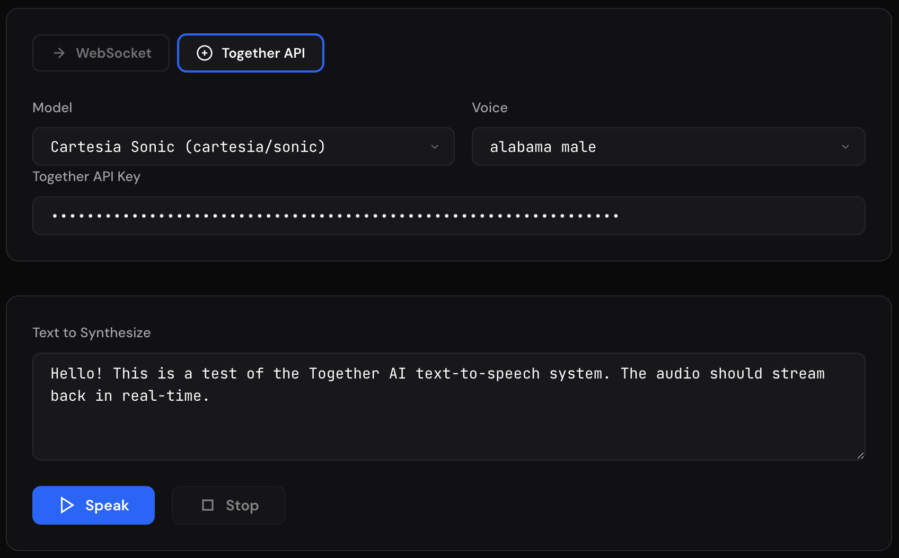

# Together AI Voice Demo

Test and evaluate Together AI voice models with included CLI scripts and a **web UI**. Supports both text-to-speech (TTS) and speech-to-text (ASR).

**Text to Speech:**
- **Together API** — Call any Together AI TTS model directly via the REST API. Supports streaming, voice selection, and TTFB benchmarking.
- **WebSocket** — Connect to a Together AI TTS WebSocket deployment for real-time streaming.

**Speech to Text:**
- Stream microphone audio to an ASR deployment and see live transcription in your terminal or browser.



## Prerequisites

- Python 3.10+
- Node.js 18+ (for the web UI only)
- A [Together AI API key](https://api.together.ai/settings/api-keys)

---

## Quick Start — Together API (CLI)

The fastest way to hear a Together AI TTS model. The CLI streams audio to your speakers and logs time-to-first-byte (TTFB).

### Setup

```bash
cd cli
pip install -r requirements.txt
```

### Available Models

| Model | ID | Example Voices |
|-------|----|----------------|
| Orpheus 3B | `canopylabs/orpheus-3b-0.1-ft` | `tara`, `leah`, `jess`, `leo`, `dan`, `mia`, `zac`, `zoe` |
| Kokoro 82M | `hexgrad/Kokoro-82M` | `af_heart`, `af_alloy`, `af_bella`, `am_adam`, `am_echo`, `bf_emma`, `bm_george` |
| Cartesia Sonic 3 | `cartesia/sonic-3` | `sweet lady`, `newsman`, `california girl`, `british lady`, `indian man` |
| Cartesia Sonic 2 | `cartesia/sonic-2` | `sweet lady`, `reading man`, `calm lady`, `commercial man` |
| Cartesia Sonic | `cartesia/sonic` | `sweet lady`, `newsman`, `reading lady`, `pilot over intercom` |

> For the full list of voices for each model, see the [Together AI TTS documentation](https://docs.together.ai/docs/text-to-speech).

### Run

**Orpheus 3B** (streaming):

```bash
python tts_stream.py "Hello! This is a test of the Orpheus model." \
  --model canopylabs/orpheus-3b-0.1-ft \
  --voice tara \
  --api-key $TOGETHER_API_KEY
```

**Kokoro 82M** (streaming):

```bash
python tts_stream.py "Hello! This is a test of the Kokoro model." \
  --model hexgrad/Kokoro-82M \
  --voice af_heart \
  --api-key $TOGETHER_API_KEY
```

**Cartesia Sonic 3**:

```bash
python tts_stream.py "Hello! This is a test of Cartesia Sonic 3." \
  --model cartesia/sonic-3 \
  --voice "german conversational woman" \
  --api-key $TOGETHER_API_KEY
```

**Cartesia Sonic 2**:

```bash
python tts_stream.py "Hello! This is a test of Cartesia Sonic 2." \
  --model cartesia/sonic-2 \
  --voice "sweet lady" \
  --api-key $TOGETHER_API_KEY
```

### Example output

```
Model: canopylabs/orpheus-3b-0.1-ft
Voice: tara
Text: Hello! This is a test of the Orpheus model.

Request sent, waiting for audio...

⚡ TTFB: 142ms

🔊 +0.48s (1.23s total)
✓ Complete: 2.56s total audio
Done.
```

### CLI Options

| Flag | Description |
|------|-------------|
| `text` (positional) | Text to synthesize |
| `--model`, `-m` | Together AI model ID (e.g. `canopylabs/orpheus-3b-0.1-ft`) |
| `--voice`, `-v` | Voice name (defaults: Orpheus → `tara`, Kokoro → `af_heart`, Cartesia → `sweet lady`) |
| `--api-key`, `-k` | Together API key (or set `TOGETHER_API_KEY` env var) |
| `--url`, `-u` | WebSocket URL — use instead of `--model` for WebSocket mode |
| `--lang`, `-l` | Language code for WebSocket mode (default: `en`) |

You can set your API key as an environment variable to avoid passing it every time:

```bash
export TOGETHER_API_KEY="your-key-here"
python tts_stream.py "Hello world" --model canopylabs/orpheus-3b-0.1-ft
```

---

## Quick Start — Speech to Text (CLI)

Stream live microphone audio to a Together AI ASR deployment and see transcription in your terminal.

### Setup

```bash
cd cli
pip install -r requirements.txt
```

### Run

You'll need a **Deployment ID** for your ASR model and a Together API key.

**Basic usage:**

```bash
python asr_stream.py \
  --deployment-id your-deployment-id \
  --api-key $TOGETHER_API_KEY
```

**Specify a language:**

```bash
python asr_stream.py \
  --deployment-id your-deployment-id \
  --lang ja
```

**Using environment variables** (no flags needed):

```bash
export DEPLOYMENT_ID="your-deployment-id"
export TOGETHER_API_KEY="your-key-here"
python asr_stream.py
```

**Direct WebSocket URL** (for local testing):

```bash
python asr_stream.py --url ws://localhost:6380/v1/realtime
```

### Example output

```
=== Streaming Speech-to-Text ===
Connecting to: wss://api.together.ai/v1/deployment-request/.../v1/realtime
Language: en
Audio: 24000Hz, 1ch, int16 PCM
Speak into your microphone. Press Ctrl+C to stop.

  Recording... (Ctrl+C to stop)

  Ready — listening...

  >> Hello, this is a test of the speech to text system.
  >> It transcribes in real time as you speak.
```

### ASR CLI Options

| Flag | Description |
|------|-------------|
| `--deployment-id`, `-d` | Together AI deployment ID (or set `DEPLOYMENT_ID` env var) |
| `--api-key`, `-k` | Together API key (or set `TOGETHER_API_KEY` env var) |
| `--lang`, `-l` | Language code (default: `en`) |
| `--url`, `-u` | Direct WebSocket URL — overrides `--deployment-id` for local testing |

---

## Web UI

A browser-based interface with model/voice selection, real-time audio visualization, TTFB measurement, and an event log. The web UI uses a lightweight Python backend that relays API calls and proxies WebSocket connections.

### Architecture

```
┌─────────────────┐     WebSocket      ┌─────────────────┐
│                 │  ◄──────────────►  │                 │
│  Browser (UI)   │                    │  Python Backend  │──► Together REST API
│                 │   Audio Chunks     │    (FastAPI)     │──► TTS WebSocket Server
└─────────────────┘                    └─────────────────┘
```

### 1. Start the backend

```bash
cd backend
uv venv && source .venv/bin/activate
uv pip install -e .
uvicorn main:app --reload --port 8800
```

> Don't have [uv](https://github.com/astral-sh/uv)? You can use `python -m venv .venv && source .venv/bin/activate && pip install -e .` instead.

You should see:

```
INFO:     Uvicorn running on http://0.0.0.0:8800
INFO:     🚀 Together AI Voice Demo backend starting...
```

### 2. Start the frontend

Open a **second terminal**:

```bash
cd frontend
npm install
npm run dev
```

You should see:

```
  VITE v5.x.x  ready in xxx ms

  ➜  Local:   http://localhost:5180/
```

### 3. Use the demo

Open [http://localhost:5180/](http://localhost:5180/) in your browser.

#### Together API mode (recommended for getting started)

1. Click the **Together API** tab at the top of the config panel
2. **Model** — Pick a model from the dropdown (Orpheus 3B, Kokoro 82M, Cartesia Sonic 3/2/1), or select "— Custom —" to type any model ID
3. **Voice** — The voice dropdown automatically populates with all available voices for the selected model. Pick one, or select "— Custom —" to type any voice name
4. **Together API Key** — Paste your [Together AI API key](https://api.together.ai/settings/api-keys)
5. **Text** — Enter the text you want to synthesize
6. Click **Speak** (or press `Cmd/Ctrl + Enter`)

Once audio starts streaming, you'll see:
- A **TTFB banner** showing the time-to-first-byte in large text (color-coded: green < 200ms, yellow < 500ms, red ≥ 500ms)
- A real-time **audio visualizer** showing frequency bars
- An **event log** with detailed timing information

#### WebSocket mode

1. Click the **WebSocket** tab
2. **WebSocket URL** — Enter your TTS server URL
   - Together deployment: `wss://api.together.ai/v1/deployment-request/{deployment-id}/v1/tts/ws`
   - Local server: `ws://localhost:6380/v1/tts/ws`
3. **API Key** (optional) — Your Together API key for authenticated endpoints
4. **Language** — Language code (e.g. `en`, `ja`, `es`)
5. **Text** — Enter text and click **Speak**

#### Speech to Text

Switch to **Speech to Text** using the tabs in the header.

1. **Deployment ID** — Enter your ASR deployment ID
2. **Together API Key** — Paste your [Together AI API key](https://api.together.ai/settings/api-keys)
3. **Language** — Language code (default: `en`)
4. Click **Start Listening** — your browser will request microphone permission
5. Speak into your microphone — partial transcription appears in grey/italic, finalized segments turn white

Click **Stop** when done.

> **Tip:** All settings are saved to your browser's localStorage, so they persist between sessions.

---

## WebSocket Protocol

Both tools support a JSON message protocol compatible with Together AI TTS WebSocket deployments:

### Client → Server

```json
{"type": "open", "language": "en"}
{"type": "text", "text": "Hello!"}
{"type": "eos"}
```

### Server → Client

```json
{"type": "session.created", "language": "en", "format": "float32", "sample_rate": 24000}
{"type": "audio.chunk", "audio": "<base64>", "isFinal": false}
{"type": "audio.chunk", "audio": "<base64>", "isFinal": true}
{"type": "error", "message": "Error description"}
```

Audio is base64-encoded float32 PCM at 24 kHz mono.

---

## Project Structure

```
voice-demo/
├── cli/
│   ├── tts_stream.py     # TTS CLI (WebSocket + Together API)
│   ├── asr_stream.py     # ASR CLI (streaming mic-to-transcript)
│   └── requirements.txt
├── backend/
│   ├── main.py           # FastAPI backend (TTS proxy + ASR proxy)
│   └── pyproject.toml
├── frontend/
│   ├── index.html        # Main HTML (TTS + ASR views, tabbed layout)
│   ├── src/
│   │   ├── main.ts       # Client logic (TTS audio, ASR mic capture, transcripts)
│   │   └── style.css     # Dark theme styles
│   ├── package.json
│   └── vite.config.ts
├── docs/
│   ├── screenshot.png    # WebSocket mode screenshot
│   └── screenshot2.png   # Together API mode screenshot
├── LICENSE
└── README.md
```

## Troubleshooting

| Issue | Solution |
|-------|----------|
| `unsupported_language` error | Use ISO 639-1 codes: `en`, `ja`, `es`, etc. (not `jp`) |
| No audio plays in browser | Check browser console; ensure AudioContext is allowed (click the page first) |
| Connection refused | Verify the backend is running on port 8800 |
| CORS errors | Use the backend proxy; don't connect to the Together API directly from the browser |
| CLI: `No module named sounddevice` | Run `pip install -r requirements.txt` in the `cli/` directory |
| CLI: `No module named httpx` | Run `pip install -r requirements.txt` in the `cli/` directory |
| Together API: 401 error | Check your API key is correct and has TTS access |
| Together API: no audio | Verify the voice name is valid for the selected model |
| ASR: "Mic denied" in browser | Allow microphone access when prompted; HTTPS or localhost required |
| ASR: no transcription | Verify deployment ID is correct and the deployment is running |
| ASR CLI: connection refused | Check your deployment ID and API key; ensure the deployment is active |

## License

This project is provided under the MIT License. See [LICENSE](LICENSE) for details.

THE SOFTWARE IS PROVIDED "AS IS", WITHOUT WARRANTY OF ANY KIND. See the LICENSE
file for the full disclaimer.
