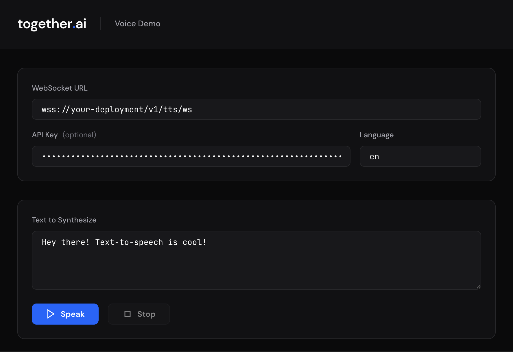

# Together AI Voice Demo

Test and evaluate Together AI's WebSocket-based text-to-speech streaming with two included tools: a **CLI script** that plays audio straight to your speakers, and a **web UI** with real-time visualization.



## Prerequisites

- Python 3.10+
- Node.js 18+ (for the web UI only)
- A Together AI TTS WebSocket URL (e.g. `wss://api.together.ai/v1/deployment-request/{deployment-id}/v1/tts/ws`)
- A Together AI API key (if your endpoint requires authentication)

---

## Option 1 — CLI (quickest way to hear audio)

The CLI script connects directly to a TTS WebSocket server, streams audio to your speakers, and logs time-to-first-byte (TTFB).

### Setup

```bash
cd cli
pip install -r requirements.txt
```

### Run

```bash
python tts_stream.py "Hello world" \
  --url wss://api.together.ai/v1/deployment-request/your-deployment/v1/tts/ws \
  --api-key $TOGETHER_API_KEY
```

You can also set environment variables instead of passing flags:

```bash
export TTS_WS_URL="wss://api.together.ai/v1/deployment-request/your-deployment/v1/tts/ws"
export TOGETHER_API_KEY="your-key"
python tts_stream.py "Hello world"
```

### Example output

```
Connecting to: wss://api.together.ai/v1/deployment-request/xxx/v1/tts/ws
Language: en
Text: Hello world

Request sent, waiting for audio...
Session: float32 @ 24000Hz

⚡ TTFB: 142ms

🔊 +0.48s
✓ Complete: 1.23s total audio
Done.
```

### CLI options

| Flag | Description |
|------|-------------|
| `--url`, `-u` | WebSocket URL (or set `TTS_WS_URL`) |
| `--api-key`, `-k` | API key (or set `TOGETHER_API_KEY`) |
| `--lang`, `-l` | Language code, default `en` |

---

## Option 2 — Web UI

A browser-based interface with audio visualization, an event log, and support for multiple languages. The web UI uses a lightweight Python backend that proxies your browser's WebSocket connection to the TTS server.

### Architecture

```
┌─────────────────┐     WebSocket      ┌─────────────────┐     WebSocket     ┌─────────────────┐
│                 │  ◄──────────────►  │                 │  ◄─────────────►  │                 │
│  Browser (UI)   │                    │  Python Backend  │                   │   TTS Server    │
│                 │   Audio Chunks     │    (Proxy)       │    TTS Protocol   │                 │
└─────────────────┘                    └─────────────────┘                   └─────────────────┘
```

### 1. Start the backend

```bash
cd backend
uv venv && source .venv/bin/activate
uv pip install -e .
uvicorn main:app --reload --port 8000
```

> Don't have [uv](https://github.com/astral-sh/uv)? You can use `python -m venv .venv && source .venv/bin/activate && pip install -e .` instead.

You should see:

```
INFO:     Uvicorn running on http://0.0.0.0:8000
INFO:     🚀 Together AI Voice Demo backend starting...
```

### 2. Start the frontend

Open a **second terminal**:

```bash
cd frontend
npm install
npm run dev
```

You should see:

```
  VITE v5.x.x  ready in xxx ms

  ➜  Local:   http://localhost:5173/
```

### 3. Use the demo

Open [http://localhost:5173/](http://localhost:5173/) in your browser, then:

1. **WebSocket URL** — Enter your TTS server URL
   - Together deployment: `wss://api.together.ai/v1/deployment-request/{deployment-id}/v1/tts/ws`
   - Local server: `ws://localhost:6380/v1/tts/ws`
2. **API Key** (optional) — Your Together API key for authenticated endpoints
3. **Language** — Language code (e.g. `en`, `ja`, `es`)
4. **Text** — Enter the text you want to synthesize
5. Click **Speak** to stream audio!

> **Tip:** Press `Cmd+Enter` (or `Ctrl+Enter`) in the text area to speak without clicking the button.

---

## WebSocket Protocol

Both tools use a simple JSON message protocol compatible with Together AI TTS deployments:

### Client → Server

```json
{"type": "open", "language": "en"}     // Start session
{"type": "text", "text": "Hello!"}     // Send text
{"type": "eos"}                         // End of stream
```

### Server → Client

```json
{"type": "session.created", "language": "en", "format": "float32", "sample_rate": 24000}
{"type": "audio.chunk", "audio": "<base64>", "isFinal": false}
{"type": "audio.chunk", "audio": "<base64>", "isFinal": true}
{"type": "error", "message": "Error description"}
```

Audio is base64-encoded float32 PCM at 24kHz mono.

## Project Structure

```
voice-demo/
├── cli/
│   ├── tts_stream.py     # CLI streaming client
│   └── requirements.txt  # CLI dependencies
├── backend/
│   ├── main.py           # FastAPI WebSocket proxy
│   └── pyproject.toml    # Backend dependencies
├── frontend/
│   ├── index.html        # Main HTML
│   ├── src/
│   │   ├── main.ts       # WebSocket client & audio
│   │   └── style.css     # Styles
│   ├── package.json
│   └── vite.config.ts
├── docs/
│   └── screenshot.png
├── LICENSE
└── README.md
```

## Troubleshooting

| Issue | Solution |
|-------|----------|
| `unsupported_language` error | Use ISO 639-1 codes: `en`, `ja`, `es`, etc. (not `jp`) |
| No audio plays | Check browser console; ensure AudioContext is allowed |
| Connection refused | Verify backend is running on port 8000 |
| CORS errors | Use the backend proxy; don't connect directly from browser |
| CLI: `No module named sounddevice` | Run `pip install -r requirements.txt` in the `cli/` directory |

## License

This project is provided under the MIT License. See [LICENSE](LICENSE) for details.

THE SOFTWARE IS PROVIDED "AS IS", WITHOUT WARRANTY OF ANY KIND. See the LICENSE
file for the full disclaimer.
